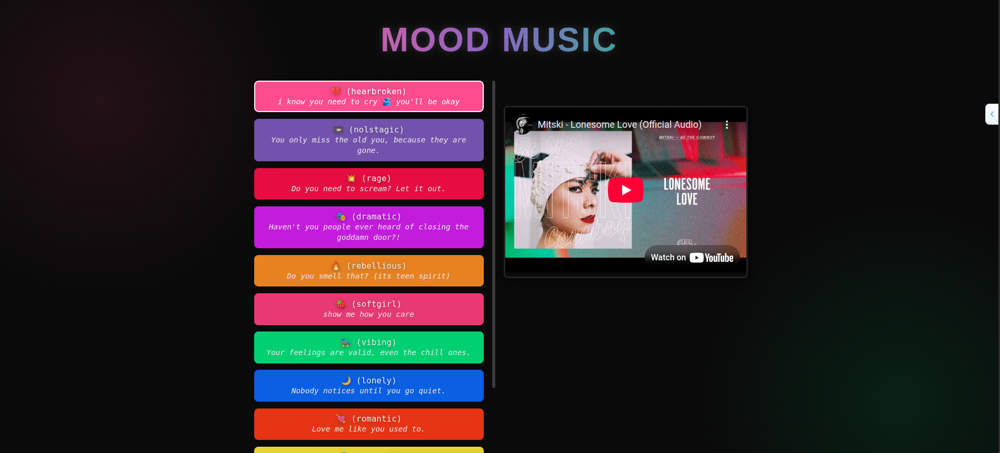

# 🎵 MOOD MUSIC  
*React app that plays your emotions back to you (with sound)*  
(｡•́︿•̀｡) ♫ 💔 🕊️  

## ✨ Features  
- 🎭 15+ curated moods — from *heartbroken* to *euphoric*  
- 🎶 Embedded YouTube playlists for every mood  
- 💬 Lyrical snippets for soft motivation & ✨ existential validation  
- 🎲 "Surprise Me" button — because chaos is a vibe  
- 📱 Fully responsive and vibey hover animations  

## 🎨 Design  
- Bold alt-indie color palette (earthy tones, vapor glows, messy gradients)  
- Custom pixel fonts and gritty text overlays (ﾉ◕ヮ◕)ﾉ*:･ﾟ✧  
- Mobile-first, grid-based layout  
- Accessible contrast ratios — dramatic **but** readable  

## 🛠 Tech Stack  
- ⚛️ React (with Vite for that fast dev life)  
- 🎨 Vanilla CSS (no frameworks — we rawdogged the styling)  
- 🎥 YouTube IFrame API for seamless song delivery  
- 🧪 Built for modern browsers only 

## 🚀 Getting Started 

### Running it locally

```bash
git clone https://github.com/yourusername/moodmusic.git  
cd moodmusic  
npm install  
npm run dev  

```
### alternatively the link on gh-pages

https://ethereal-edith.github.io/moodmusic/

---
💡 Recommended mood for setup: “grunge coding tunnel” 🎧 — play some Nirvana while it installs

📸 Preview


--- 

📜 License
MIT — "Do whatever, just don’t delete the vibes (or my name)."
(づ￣ ³￣)づ

---

# 💭 A Note from the Dev
This app was made in a soft moment and a little chaos.
Use it when:

you’re feeling too much (or nothing at all)

you need a song to scream into your pillow

you want to find beauty in the breakdown

💌 Feel free to fork, remix, and add your own moods. Just don’t forget to cry a little. Or dance. Or both. (´｡• ᵕ •｡`) ♡


